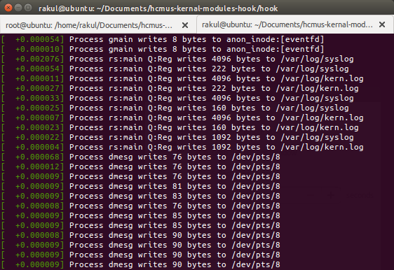

# Linux Kernal Modules and Hook

This repository contains a coursework of Operation System.

### 1. Linux Kernal Modules
- Write a kernal module to generate a random number.
- Create a character device file to pass (specifically, read and write) generated number between Linux user-space program and a loadable kernal module (LKM), which is running in Linux kernal space.

### 2. System Call Hooking
- `open` system call: include process name and name of opened file in dmesg
- `write` system call: include process name and name of written file in dmesg

Change directory to `hook` and compile:
```terminal
cd hook
make
```

Open a new terminal for observing kernel messages:
```terminal
dmesg -C
dmesg -wH
```

**Note:** Login as root to perform following operations.

Load new module `hook.ko`:

```terminal
insmod hook.ko
```

Unload module `hook.ko`
```terminal
rmmod hook.ko
```


